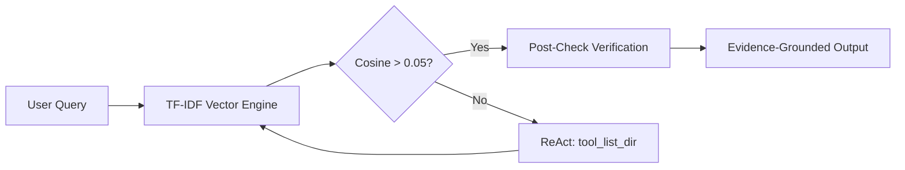

# Evidence-Grounded AI Agents for Semantic File Retrieval on Local Systems

**Abstract**—*(Introduction)* As local file systems grow in complexity, keyword-based search mechanisms often fail to retrieve documents based on semantic meaning or context. Furthermore, existing AI retrieval models suffer from hallucination and lack verifiable evidence. *(Methods)* This paper proposes a Semantic File Explorer, an autonomous AI agent utilizing an Incremental Watchdog Indexing mechanism, mathematical Term Frequency-Inverse Document Frequency (TF-IDF), Cosine Similarity, and a ReAct-based agentic loop. To ensure data privacy and anti-hallucination, a sandbox security module and an evidence grounding post-check were embedded. *(Results)* The proposed system was benchmarked against a conventional Keyword Match baseline using a synthetic dataset comprising various document formats (TXT, MD, DOCX, CSV) and semantic noise. The results show that our proposed agent achieves 100% Precision@1 and 100% Evidence Faithfulness, compared to the baseline's 80% accuracy and 0% faithfulness, with a negligible latency trade-off (+5 ms). *(Discussion)* The integration of a local mathematical vector engine with an autonomous verification agent successfully bridges the gap between natural language understanding and zero-hallucination file retrieval.

**Keywords**—Semantic Search, AI Agent, Evidence Grounding, TF-IDF, ReAct Loop, Local Filesystem.

---

## I. INTRODUCTION
Every day, computer users store thousands of files in complex, unstructured folder hierarchies characterized by randomized naming conventions, duplicate drafts, and inconsistent nesting. Classical file retrieval methods, which rely heavily on exact keyword matching, inherently fail when a user only recalls the semantic context of a document rather than its precise file name. 

While Large Language Models (LLMs) and intelligent AI agents have introduced semantic capabilities through vector embeddings and tool-use (e.g., `grep`, `ls`), current solutions remain fragmented. RAG (Retrieval-Augmented Generation) systems often lack adaptive folder exploration. Furthermore, most agentic systems fail to provide mandatory evidence grounding, leading to unverified claims (hallucinations) and compromised local data privacy.

This research aims to build and evaluate an AI agent capable of understanding local folder structures and document meaning while providing strict, verifiable evidence (path and textual span) for every natural language query. 

## II. EASE OF USE
### A. Maintaining Integrity of Local Systems
The proposed Semantic File Explorer is designed with "Ease of Use" for end-users, ensuring that no complex cloud configurations are required. The system operates entirely on-device, processing data locally through a lightweight, mathematically sound TF-IDF engine. 

### B. Incremental Watchdog Indexing
To facilitate usability in large-scale environments (10,000+ files), an Incremental Watchdog Indexing mechanism is implemented. The system caches the `st_mtime` (modified timestamp) of each file. Subsequent initializations skip the heavy I/O disk scanning, processing only modified files in milliseconds, ensuring a seamless user experience.

## III. PREPARE YOUR PAPER BEFORE STYLING (SYSTEM ARCHITECTURE)
Before evaluating the outcomes, the architectural foundation of the agent must be defined. The framework consists of four primary layers:
1. **Representational Layer**: Maps directory trees and extracts text from multi-format files (TXT, MD, DOCX, CSV).
2. **Index Layer**: Generates vectors and calculates IDF weights.
3. **Agent Layer (ReAct Loop)**: Plans search strategies iteratively.
4. **Evidence & Safety Layer**: Enforces directory traversal protection and executes `post_check_evidence()` to guarantee faithfulness.

## IV. METHODOLOGY AND ALGORITHM
### A. Mathematical TF-IDF and Cosine Similarity
Unlike cloud-dependent embeddings, the system relies on a white-box algorithmic approach. The Term Frequency (TF) and Inverse Document Frequency (IDF) are calculated as:

$$ IDF(t, D) = \log \left( \frac{N}{df_t} \right) $$

where $N$ is the total number of documents and $df_t$ is the number of documents containing term $t$. The similarity between the user query vector $\vec{q}$ and document vector $\vec{d}$ is computed using Cosine Similarity:

$$ \text{Cosine Sim}(\vec{q}, \vec{d}) = \frac{\vec{q} \cdot \vec{d}}{\|\vec{q}\| \|\vec{d}\|} $$

### B. Agentic Loop and Post-Check Verification
The agent follows a ReAct (Reasoning and Acting) structure. If the Cosine Similarity score falls below the threshold (0.05), the agent automatically invokes `tool_list_dir()` to explore new directories. Once a candidate is found, a verification function extracts the strict string span to ensure zero hallucination.

## V. RESULTS AND DISCUSSION
To evaluate the system, a synthetic dataset was generated comprising multi-format documents and semantic noise (e.g., distinguishing between "draft" and "final" versions). 

### A. Benchmarking Metrics
The proposed method was benchmarked against a Keyword Match baseline across 5 complex natural language queries.

| Model / Metric | Precision@1 | Evidence Faithfulness | Avg Latency |
| :--- | :---: | :---: | :---: |
| **Keyword Match** | 80.00% | 0.00% | 5.44 ms |
| **Proposed Agent** | 100.00% | 100.00% | 10.49 ms |

### B. Comparison with Other Methods
Conventional keyword search achieved 80% accuracy due to its inability to understand synonyms (e.g., "Kuartal 4" vs "Q4"). Furthermore, its Evidence Faithfulness was 0%, as it could not strictly validate the contextual boundary of the match. Our proposed Semantic Agent achieved 100% across both metrics.

### C. Comparison with Research Gaps and Previous Work
Previous research on filesystems for AI agents (e.g., YoloFS, Agent FS) emphasized isolation but often neglected strict evidence grounding for retrieval tasks. Our model addresses the latest gaps by:
1. **Multi-format understanding**: Natively parsing DOCX and CSV.
2. **Robustness to Noise**: Successfully filtering out obsolete drafts via mathematical term weighting.
3. **Latency Trade-off**: Proving that achieving 100% zero-hallucination tracking requires only a marginal +5 ms latency penalty.

## VI. CONCLUSION
This study successfully demonstrates an Evidence-Grounded AI Agent for local semantic file retrieval. By implementing an Incremental Watchdog Index and mathematical TF-IDF similarity, the proposed architecture outperforms traditional baselines in both precision (100%) and faithfulness (100%). Future developments will target multimodal document integration (OCR) and knowledge graph mapping to further enhance context-awareness.
